# Звіт до роботи
## Тема: _Робота з віртуальними середовищами_
### Мета роботи: _Навчитись створювати та працювати у віртуальних середовищах_

---
### Виконання роботи
* Результати виконання завданнь:
    1. Створили [тестову програму з використання інстальованої бібліотеки `numpy`](./new.py).
    1. Пробували інсталювати бібліотеку глобально, із заданою версією, з використанням команд
    ```bash
    pip install numpy==1.25
    # Далі ми змогли запустити нашу програму на виконання
    python 1_lab/new.py
    ```
    1. Результат виконання команд представлено на скріншоті:
    
    1. Перевірили поточну бібліотеку, її версію: 
    
    1. та встановили останню версію:
    
    1. Поперредні команди виконувались у глобальному середовищі де і встановлювались пакети (бібіліотеки). У такому випадку наші бібліотеки будуть доступними для будь якого проекту.
    1. Зробили 2 проекти які потребують різних бібліотек. Для кожного з проектів буде створено своє віртуальне середовище за допомогою наступних команд:
        ```bash
        cd 1_lab/1_project/
        python -m venv ./project_one
        source project_one/Scripts/activate
        pip install requests
        python 1.py
        ```
    1. Результат запуску програми у проекті 1 представлено на скріншоті
    
    1. Після успішного сторення та використання проекту 1 було створено проект 2 та виконано програму яка потребує бібліотеки numpy
    
    1. Дадали папки з віртуальним середовищем до зонфігураційного файл `.gitignore`.
    1. Кожного разу коли репозиторій буде зклоновано на новий ПК у нього не буде створені локального віртуального середовища, відповідно нам буде потрібно повторити всі команди для створення VEVN та інсталяції потрібних бібліотек у середовище. Для автоматизації такого процесу використовується Bash скрипти. Ми робимо це наступним чином:
        1. Практикуємось у проекті 1. Створюємо перший скрипт з назвою [set-up.sh](./1_project/set-up.sh) та першою стрічкою записуємо [Shebang](https://uk.wikipedia.org/wiki/%D0%A8%D0%B5%D0%B1%D0%B0%D0%BD%D0%B3_(Unix))
        1. У скрипті ми зібрали набір команд для створення та налаштування віртуальнго середовища. Результат запуску скрипта наступний 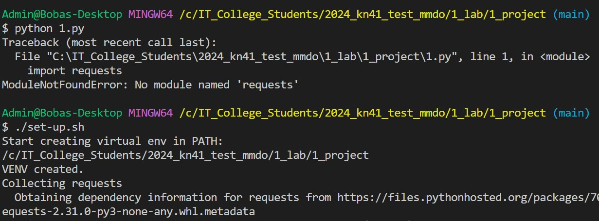
        1. Після успішного створення середровища ми вже можемо з ним працювати, що показано на наступного скріні 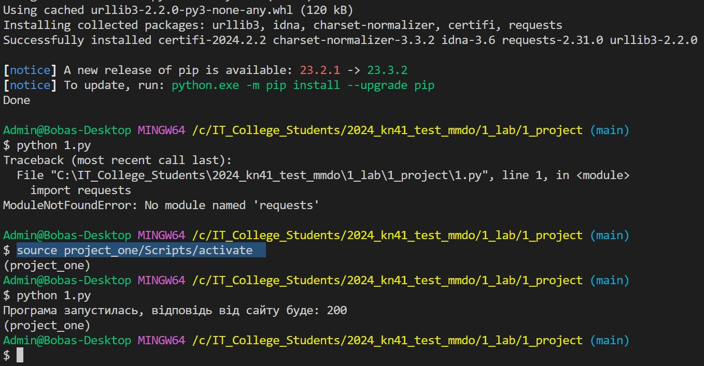
        1. Ці команди автоматизують процес створення середовища у проекті 1.
    1. Якщо ми маємо декілька проектів з якими працюємо у єдиному репозиторію, можемо робити скрипти для кожного проекту окремо, і тоді файли будуть дублюватись, або можемо зробити один на всіх. Це робиться з дейкими параметризаціями.
        1. Щоб не зломати попередні скрипти створили новий скрипт з назвою [set-up-v1.sh](./set-up-v1.sh).
        1. У ньому ми задали змінну яка відповідає папці проекту, а саме `name="2_project"`;
        1. Трохи можифікували назву папки віртуального середовища, назва тепер буде складатись як `./venv_$name` - також треба модифікувати `.gitignore` та не комітити папку віртуального середовища з новим іменем.
        1. Результат недовершеного скрипта наступний 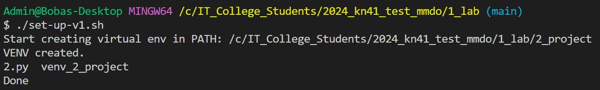
        1. Щоб не інсталювати бібліотеки по одній (тобто явно в команді pip) ми стоврили спеціальний файл під назвою [`requirements.txt`](./2_project/requirements.txt) в якому просто вказали набір потрібних бібліотек.
        1. Додали команди у скрипт та вказали як інсталювали бібліотеки з файла.
        1. Результат роботи представлено на скріншоті: 
    1. Модифікували скрипт, [set-up-v2.sh](./set-up-v2.sh) та додали можливість предавати позиційні аргументи які відповідають назві папки проекту. Тепер ми можемо налаштовувати одним скриптом зразу обидва проекти. Для цього воконуємо наступні команди:
        ```bash
        ./set-up-v2.sh 1_project
        cd 1_project/
        source venv_1_project/Scripts/activate
        python 1.py 
        deactivate
        # Так само можна буде зробити з проектом 2
        ./set-up-v2.sh 2_project
        ```
    1. Окрім написання скриптів на Bash можна також використовувати чисто Пайтонівський шлях для роботи з віртуальними середовищами. Для цього потрібно використовувати спеціальну бібліотеку `pipenv` (зараз набуває популярності схожа утиліта яка називається `poetry`).
        1. Інсталюємо інструмент `pipenv` глобально
            ```bash
            pip install pipenv
            # Далі можемо викликати програму та подивитись що вона може
            pipenv --help
            pipenv --where
            pipenv --venv
            ```
        1. Створимо папку та в ній проект з використання утиліти `pipenv`
            ```bash
            pipenv --python 3.11
            ```
        1. Середовище створилось у глобальній папці `C:\Users\Admin\.virtualenvs\3_project-SCYjHmUW`, що з одного боку добре і VisualStudio зможе бачити Ваше віртуальне середовище що показано на скріні 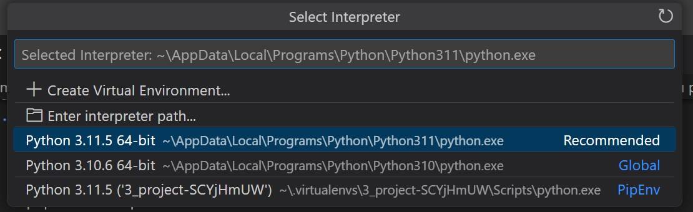
        1. З іншого боку ми не бачимо де є середовище і повинні викоистовувати команди щоб вивести про нього інформацію 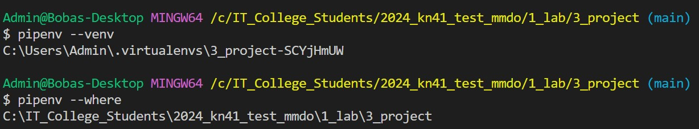
        1. Для того щоб створити середовище у папці проекту, ми виконуємо команди
            ```bash
            # видаляємо попереднє сердовище
            pipenv --rm
            # та створюємо його де нам потрібно
            export PIPENV_VENV_IN_PROJECT=1
            pipenv --python 3.11
            ```
        1. Виконання команд 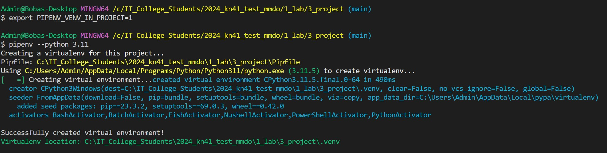
        1. Якщо ми закриємо наш термінал, то сердовище знову буде створюватись у папці за замовчуванням, тому в даномсу випадку потрібно додавати змінну середовища щоб створювати проект у локальній папці.
        1. Далі ми інсталюємо потрібні для роботи бубліотеки. Є бібліотеки потрібні для самого проекту та бібліотеки для розробки проекту. Бібліотеки для розробки це dev бібліотеки і вони інсталюються у спеціальну секцію яка відображається у `Pipfile`. Для проекту нам потрібна бібліотека `requests` а для розробки `pytest`. Виконуємо команди:
            ```bash
            pipenv install requests
            pipenv install pytest --dev
            ```
        1. Інсталяція бібліотек виглядає наступним чином: 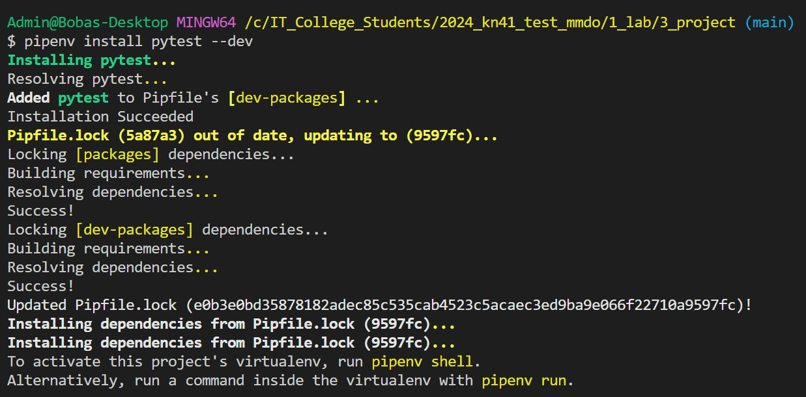
        1. Після встановлення бібліотек в нас зявляться та заповняться файли [Pipfile](./3_project/Pipfile) та [Pipfile.lock](./3_project/Pipfile.lock)
        1. Після налаштування середовища ми можемо почати працювати в ньому, або можемо його перестворити за допомогою команд:
            ```bash
            pipenv --rm # видялає поточне середовище
            pipenv install # інсталює середовище та всі бібліотеки проекту
            pipenv install --dev # інсталює середовище та бібліотеки розробки
            ```
            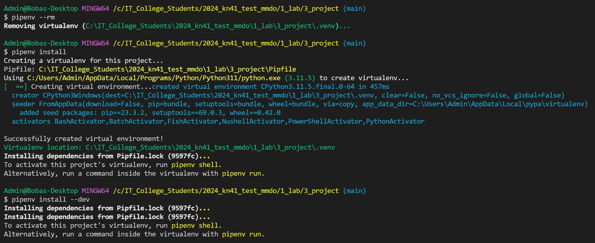
        1. Ми можемо виконати команди в середовищі не заходячи в нього за допомогою команди `pipenv run команда` або зайти і почати працювати в середовищі `pipenv shell`
            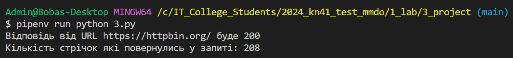 VS 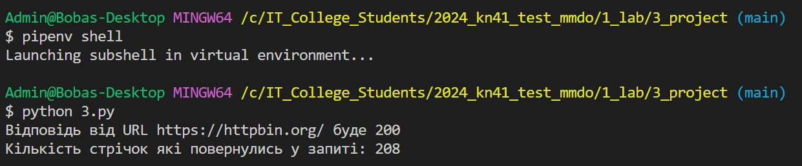
        1. Для того щоб при роботі з Пайтон програмами ми могли використовувати Visual Studio Code потрібно зконфігурувати Python Interpreter через вікно конфігурації `Command Palette` і далі ми можемо запускати Пайтон програму за допомогою команди Run (трикутника). Результат предсталено на скріні 
        1. При закритті терміналу, всі змінні середовища пропадають, тому нам кожного разу буде потрібно задавати нашу конфігураційну змінну `PIPENV_VENV_IN_PROJECT`. Для `pipenv` ми можемо всі змінні середовища помісти у фалй [.env](./3_project/.env), вони будуть автоматично присутніми у середовищі, а також ми зможемо такі змінні використовувати у Пайтон програмах. Після перестворення проекту та запуску програми, ми бдемо мати середовище в якому будуть присутні змінні з файла та ми їх зможемо викликати у програмі. Виконуємо команди і дивимось на результат:
            ```bash
            # створюємо нове термінальне вікно
            cd  1_lab/3_project/
            pipenv --rm
            pipenv install
            pipenv run python 3.py
            ```
            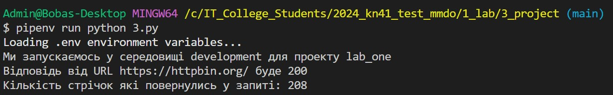

        


---
### Висновок:
> у висновку потрібно відповісти на запитання:

- :question: Що зроблено в роботі;
- :question: Чи досягнуто мети роботи;
- :question: Які нові знання отримано;
- :question: Чи вдалось відповісти на всі питання задані в ході роботи;
- :question: Чи вдалося виконати всі завдання;
- :question: Чи виникли складності у виконанні завдання;
- :question: Чи подобається такий формат здачі роботи (Feedback);
- :question: Побажання для покращення (Suggestions);

---
