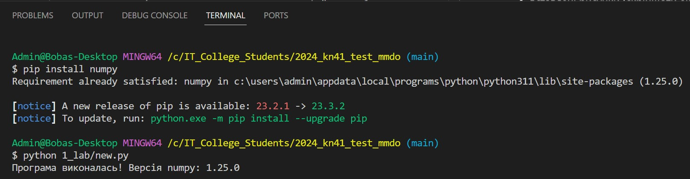
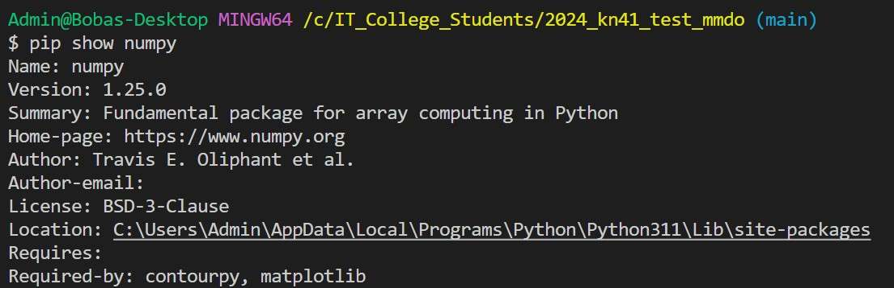
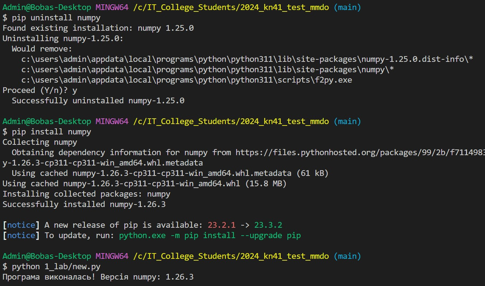
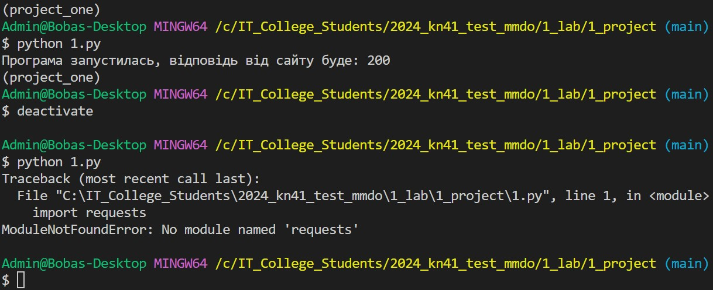
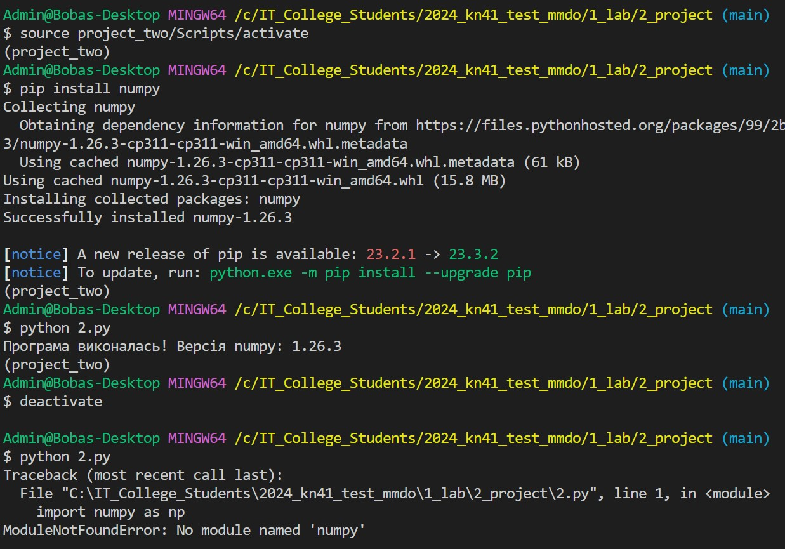

# Звіт до роботи
## Тема: _Робота з віртуальними середовищами_
### Мета роботи: _Навчитись створювати та працювати у віртуальних середовищах_

---
### Виконання роботи
* Результати виконання завданнь:
    1. Створили [тестову програму з використання інстальованої бібліотеки `numpy`](./new.py).
    1. Пробували інсталювати бібліотеку глобально, із заданою версією, з використанням команд
    ```bash
    pip install numpy==1.25
    # Далі ми змогли запустити нашу програму на виконання
    python 1_lab/new.py
    ```
    1. Результат виконання команд представлено на скріншоті:
    
    1. Перевірили поточну бібліотеку, її версію: 
    
    1. та встановили останню версію:
    
    1. Поперредні команди виконувались у глобальному середовищі де і встановлювались пакети (бібіліотеки). У такому випадку наші бібліотеки будуть доступними для будь якого проекту.
    1. Зробили 2 проекти які потребують різних бібліотек. Для кожного з проектів буде створено своє віртуальне середовище за допомогою наступних команд:
    ```bash
    cd 1_lab/1_project/
    python -m venv ./project_one
    source my_env/Scripts/activate
    pip install requests
    python 1.py
    ```
    1. Результат запуску програми у проекті 1 представлено на скріншоті
    
    1. Після успішного сторення та використання проекту 1 було створено проект 2 та виконано програму яка потребує бібліотеки numpy
    
    1. Дадали папки з віртуальним середовищем до сонфігураційного файл `.gitignore`.
    
    
    
    1. Розробили/Створили ...
    1. Програма вивела значення ...
    1. Отримано наступні результати ...
    1. Навчились ...
* вставлені рисунки (скріншоти екрана або фотографії виконаного завдання у зошиті);
    > якщо графічних файлів багато то краще помістити їх у  окрему папку, наприклад у мене це папка `pictures`. Уважно   дивіться коли вставляєте URL - файл має бути представленим    як `raw`. А краще користуйтесь локальними шляхами!

* з використанням URL 
    
* через локальні шляхи 

* вставлений код / текстовий або числовий результат / інші результати:
    - так можна вставляти код, або просто вствляйте посилання на файл з програмою;
    ```python
    def simple_function_example():
        pass
    ```
    - якщо потрібно виділити текст, тоді:
    ```text
    << Тут можна писати те що хочемо виокремити >>
    ```

* результати виконання індивідуального завдання (якщо такі є);

---
### Висновок:
> у висновку потрібно відповісти на запитання:

- :question: Що зроблено в роботі;
- :question: Чи досягнуто мети роботи;
- :question: Які нові знання отримано;
- :question: Чи вдалось відповісти на всі питання задані в ході роботи;
- :question: Чи вдалося виконати всі завдання;
- :question: Чи виникли складності у виконанні завдання;
- :question: Чи подобається такий формат здачі роботи (Feedback);
- :question: Побажання для покращення (Suggestions);

---
