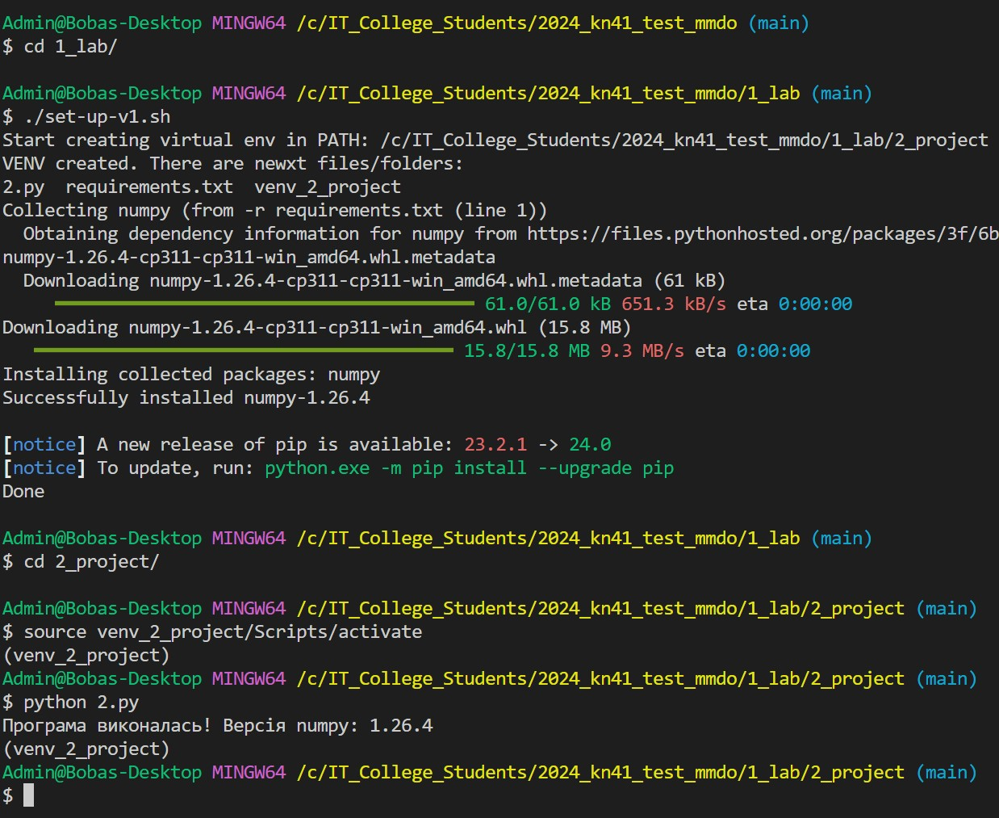

# Звіт до роботи
## Тема: _Робота з віртуальними середовищами_
### Мета роботи: _Навчитись створювати та працювати у віртуальних середовищах_

---
### Виконання роботи
* Результати виконання завданнь:
    1. Створили [тестову програму з використання інстальованої бібліотеки `numpy`](./new.py).
    1. Пробували інсталювати бібліотеку глобально, із заданою версією, з використанням команд
    ```bash
    pip install numpy==1.25
    # Далі ми змогли запустити нашу програму на виконання
    python 1_lab/new.py
    ```
    1. Результат виконання команд представлено на скріншоті:
    
    1. Перевірили поточну бібліотеку, її версію: 
    
    1. та встановили останню версію:
    
    1. Поперредні команди виконувались у глобальному середовищі де і встановлювались пакети (бібіліотеки). У такому випадку наші бібліотеки будуть доступними для будь якого проекту.
    1. Зробили 2 проекти які потребують різних бібліотек. Для кожного з проектів буде створено своє віртуальне середовище за допомогою наступних команд:
        ```bash
        cd 1_lab/1_project/
        python -m venv ./project_one
        source project_one/Scripts/activate
        pip install requests
        python 1.py
        ```
    1. Результат запуску програми у проекті 1 представлено на скріншоті
    
    1. Після успішного сторення та використання проекту 1 було створено проект 2 та виконано програму яка потребує бібліотеки numpy
    
    1. Дадали папки з віртуальним середовищем до зонфігураційного файл `.gitignore`.
    1. Кожного разу коли репозиторій буде зклоновано на новий ПК у нього не буде створені локального віртуального середовища, відповідно нам буде потрібно повторити всі команди для створення VEVN та інсталяції потрібних бібліотек у середовище. Для автоматизації такого процесу використовується Bash скрипти. Ми робимо це наступним чином:
        1. Практикуємось у проекті 1. Створюємо перший скрипт з назвою [set-up.sh](./1_project/set-up.sh) та першою стрічкою записуємо [Shebang](https://uk.wikipedia.org/wiki/%D0%A8%D0%B5%D0%B1%D0%B0%D0%BD%D0%B3_(Unix))
        1. У скрипті ми зібрали набір команд для створення та налаштування віртуальнго середовища. Результат запуску скрипта наступний 
        1. Після успішного створення середровища ми вже можемо з ним працювати, що показано на наступного скріні 
        1. Ці команди автоматизують процес створення середовища у проекті 1.
    1. Якщо ми маємо декілька проектів з якими працюємо у єдиному репозиторію, можемо робити скрипти для кожного проекту окремо, і тоді файли будуть дублюватись, або можемо зробити один на всіх. Це робиться з дейкими параметризаціями.
        1. Щоб не зломати попередні скрипти створили новий скрипт з назвою [set-up-v1.sh](./set-up-v1.sh).
        1. У ньому ми задали змінну яка відповідає папці проекту, а саме `name="2_project"`;
        1. Трохи можифікували назву папки віртуального середовища, назва тепер буде складатись як `./venv_$name` - також треба модифікувати `.gitignore` та не комітити папку віртуального середовища з новим іменем.
        1. Результат недовершеного скрипта наступний 
        1. Щоб не інсталювати бібліотеки по одній (тобто явно в команді pip) ми стоврили спеціальний файл під назвою [`requirements.txt`](./2_project/requirements.txt) в якому просто вказали набір потрібних бібліотек.
        1. Додали команди у скрипт та вказали як інсталювали бібліотеки з файла.
        1. Результат роботи представлено на скріншоті: 
    1. Модифікували скрипт, [set-up-v2.sh](./set-up-v2.sh) та додали можливість предавати позиційні аргументи які відповідають назві папки проекту. Тепер ми можемо налаштовувати одним скриптом зразу обидва проекти. Для цього воконуємо наступні команди:
        ```bash
        ./set-up-v2.sh 1_project
        cd 1_project/
        source venv_1_project/Scripts/activate
        python 1.py 
        deactivate
        # Так само можна буде зробити з проектом 2
        ./set-up-v2.sh 2_project
        ```


---
### Висновок:
> у висновку потрібно відповісти на запитання:

- :question: Що зроблено в роботі;
- :question: Чи досягнуто мети роботи;
- :question: Які нові знання отримано;
- :question: Чи вдалось відповісти на всі питання задані в ході роботи;
- :question: Чи вдалося виконати всі завдання;
- :question: Чи виникли складності у виконанні завдання;
- :question: Чи подобається такий формат здачі роботи (Feedback);
- :question: Побажання для покращення (Suggestions);

---
